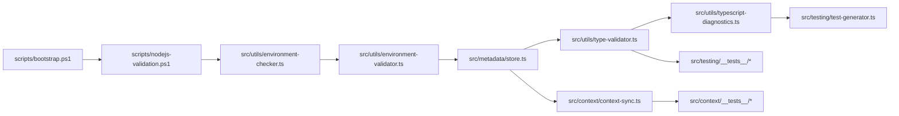

# File Mapping and Dependencies

## Project Structure Overview

This document outlines the relationships and dependencies within the project, focusing on the type system validation and testing infrastructure.



## File Descriptions and Dependencies

### Setup and Validation

* **`scripts/bootstrap.ps1`**: Orchestrates the initial setup, including Node.js environment validation. **Dependencies:** `scripts/nodejs-validation.ps1`. **Output:** Configured environment for TypeScript compilation.
* **`scripts/nodejs-validation.ps1`**: Validates the Node.js environment, ensuring the correct version and necessary packages are installed. **Dependencies:** (None explicitly listed, but likely system dependencies). **Output:** Validated Node.js environment.
* **`src/utils/environment-checker.ts`**: Checks the runtime environment for compatibility with the project. **Dependencies:** `scripts/nodejs-validation.ps1`. **Output:** Environment compatibility report.
* **`src/utils/environment-validator.ts`**: Validates the environment against project requirements. **Dependencies:** `src/utils/environment-checker.ts`. **Output:** Environment validation results, potentially stored in `src/metadata/store.ts`.

### Type System and Validation

* **`src/utils/type-validator.ts`**: Validates type assertions, checks compatibility, and detects unnecessary casts. **Dependencies:** `src/metadata/store.ts`, `src/utils/typescript-diagnostics.ts`. **Output:** Type validation results.
* **`src/utils/typescript-diagnostics.ts`**: Provides diagnostic reporting for TypeScript compilation errors and type issues. **Dependencies:** `src/utils/type-validator.ts`. **Output:** Diagnostic reports.

### Testing Infrastructure

* **`src/testing/test-generator.ts`**: Generates automated tests based on the project's code structure using AST analysis. **Dependencies:** `@typescript-eslint/parser`, `@typescript-eslint/types`. **Output:** Generated test cases with proper type safety.
* **`src/testing/__tests__/*`**: Contains the generated test suites. **Dependencies:** `src/testing/test-generator.ts`. **Output:** Test results.

### Context Management

* **`src/context/context-sync.ts`**: Manages synchronization of AI context with system state. **Dependencies:** `src/metadata/store.ts`, `src/metadata/types.ts`. **Output:** Synchronized context state.
* **`src/context/__tests__/context-sync.integration.test.ts`**: Integration tests for context synchronization. **Dependencies:** `src/context/context-sync.ts`. **Output:** Integration test results.
* **`src/context/__tests__/context-sync.test.ts`**: Unit tests for context synchronization. **Dependencies:** `src/context/context-sync.ts`. **Output:** Unit test results.

### Metadata Management

* **`src/metadata/store.ts`**: Stores metadata about the project's environment and type system. **Dependencies:** `src/utils/environment-validator.ts`, `src/utils/type-validator.ts`. **Output:** Metadata for validation and testing.
* **`src/metadata/types.ts`**: Defines TypeScript types and interfaces for the metadata system. **Dependencies:** None. **Output:** Type definitions used throughout the project.

## Critical Paths

* **Type Validation:** `src/utils/type-validator.ts` → `src/utils/typescript-diagnostics.ts` → `src/testing/test-generator.ts`
* **Test Generation:** `src/testing/test-generator.ts` → AST Analysis → Test Cases
* **Environment Validation:** `scripts/bootstrap.ps1` → `scripts/nodejs-validation.ps1` → `src/utils/environment-checker.ts` → `src/utils/environment-validator.ts` → `src/metadata/store.ts`
* **Context Synchronization:** `src/context/context-sync.ts` → `src/metadata/store.ts` → `src/metadata/types.ts`

## Type System Implementation

### AST Analysis
```typescript
// Example of type-safe AST traversal in test-generator.ts
interface FunctionInfo {
  name: string;
  params: string[];
  returnType: string;
  async: boolean;
}

// Safe node traversal with type checking
const visit = (node: TSESTree.Node): void => {
  if (node.type === 'FunctionDeclaration' && node.id) {
    // Type-safe property access
    functions.push({
      name: node.id.name,
      params: node.params.map(p => ('name' in p ? p.name : 'unknown')),
      returnType: node.returnType ? 'Promise<any>' : 'any',
      async: node.async
    });
  }
  // ...
};
```

### Infrastructure Requirements
```typescript
// Example from context-sync.ts
interface InfrastructureRequirement {
  type: InfrastructureType;
  description: string;
  specifications: {
    minimum: ResourceSpecification;
    recommended: ResourceSpecification;
  };
  scalability: ScalabilityRequirement;
  availability: string;
}
```

## Error Handling Patterns

### Type-Safe Error Handling
```typescript
try {
  // Operation
} catch (error: unknown) {
  const errorMessage = error instanceof Error ? error.message : 'Unknown error occurred';
  // Handle error
}
```

### Validation Error Handling
```typescript
interface ValidationResult {
  isValid: boolean;
  errors: string[];
  warnings: string[];
  fixes: string[];
}
```

## Best Practices

* **Type Safety:** Always use proper TypeScript types and interfaces
* **Error Handling:** Implement comprehensive error handling with proper type checking
* **Testing:** Maintain both unit and integration tests for critical components
* **Documentation:** Keep documentation in sync with code changes
* **Validation:** Implement progressive validation with clear error messages

Remember to update this file as the project evolves, particularly when:
- Adding new file dependencies
- Modifying type structures
