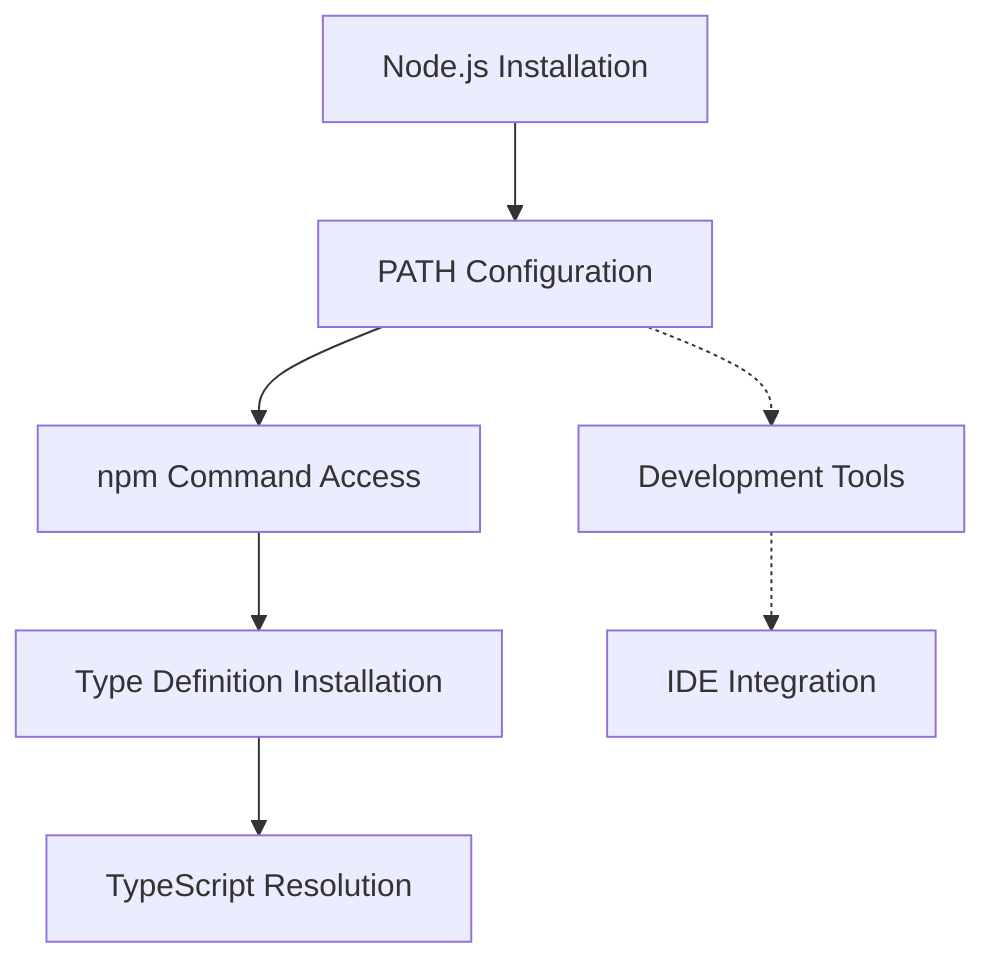

# AI-Paired Development Pipeline

## Project Vision
Our vision is to create a seamless development experience where AI acts as an intelligent pair programmer, focusing on empowering users regardless of their programming experience. The AI facilitates development by providing well-reasoned, validated solutions while maintaining transparency and user confidence.

## Core Challenges & Solutions

### 1. The 70% Problem
**Challenge:** Quick initial progress followed by diminishing returns and cascading issues.

**Solutions:**
- Implement progressive complexity tracking
- Break down solutions into verifiable chunks
- Maintain knowledge continuity between iterations
- Track and prevent cascading dependencies

### 2. Environment Validation
**Challenge:** Ensuring consistent development environments across team members.

**Solutions:**
- Comprehensive Node.js validation
- Automatic PATH repair capabilities
- Clear installation guidance
- Environment state verification

### 3. Error Prevention & Recovery
**Challenge:** Handling common setup and configuration issues.

**Solutions:**
- Character encoding validation
- PowerShell execution improvements
- Clear error messages
- Automated recovery steps

### 4. TypeScript Integration
**Challenge:** Ensuring proper type definitions and module resolution.

**Solutions:**
- Automated dependency checking
- Type definition management
- Configuration validation
- Module resolution verification

## Core Principles

### 1. Proactive Analysis
- AI evaluates requirements before implementation
- Validates against project goals
- Identifies dependencies and prerequisites
- Assesses potential impacts and risks

### 2. Transparent Decision Making
- Clear reasoning for technical choices
- Alternative approaches presented
- Impact assessment for each decision
- Resource requirements clearly stated

### 3. Progressive Validation
- Continuous alignment with project goals
- Automated testing and verification
- Security and performance considerations
- User-friendly checkpoint system

### 4. Learning Integration
- Documentation of concepts
- Explanation of patterns
- Resource linking
- Knowledge validation

## Implementation Strategy

### Phase 1: Environment Validation
```typescript
interface ValidationResult {
    isValid: boolean;
    errors: string[];
    warnings: string[];
    fixes: string[];
}

interface EnvironmentCheck {
    name: string;
    test: () => boolean;
    fix: () => boolean;
    message: string;
}
```

### Phase 2: Error Prevention
- Pre-execution validation
- Character encoding checks
- PATH configuration verification
- Installation state detection

### Phase 3: Recovery Automation
- Automatic PATH repairs
- Environment refresh
- Clear user guidance
- Validation checkpoints

## Success Metrics

### 1. Setup Success Rate
- First-time setup success
- Recovery success rate
- User intervention frequency
- Error resolution time

### 2. Environment Consistency
- Node.js configuration
- TypeScript setup
- PATH configuration
- Development tools

### 3. User Experience
- Clear error messages
- Actionable guidance
- Recovery success
- Setup time reduction

### 1. User Experience
- Clarity of AI communications
- Decision confidence
- Implementation understanding
- Time to completion
- Learning progression

### 2. Code Quality
- Test coverage
- Performance metrics
- Security compliance
- Maintainability score
- Documentation completeness

### 3. Learning Effectiveness
- Concept understanding
- Pattern recognition
- Independent problem-solving
- Knowledge retention

### 4. Development Efficiency
- Time to implementation
- Issue resolution speed
- Code reuse effectiveness
- Maintenance efficiency

## Risk Mitigation

### 1. The 70% Problem
- Progress tracking
- Complexity management
- Dependency monitoring
- Issue prevention

### 2. Knowledge Gaps
- Concept documentation
- Resource integration
- Understanding validation
- Progressive complexity

### 3. Security & Quality
- Automated scanning
- Best practice enforcement
- Dependency management
- Code review automation

## Implementation Checkpoints

1. **Initial Assessment**
   - Technical capability evaluation
   - Learning needs identification
   - Project scope definition
   - Risk assessment

2. **Development Process**
   - Regular knowledge validation
   - Code quality checks
   - Security scanning
   - Progress monitoring

3. **Continuous Improvement**
   - Feedback integration
   - Pattern recognition
   - Knowledge base expansion
   - Process optimization

## Workflow

1. **Initial Request**
   - User presents requirement
   - AI acknowledges and seeks clarification
   - Goals and constraints identified

2. **Analysis**
   - Technical requirements assessed
   - Dependencies identified
   - Impact evaluation
   - Risk assessment

3. **Proposal**
   - Implementation plan
   - Alternative approaches
   - Resource requirements
   - Timeline estimation

4. **Validation**
   - User confirmation
   - Technical verification
   - Goal alignment check
   - Security assessment

5. **Implementation**
   - Guided execution
   - Progress tracking
   - Checkpoint validation
   - Documentation updates

6. **Review**
   - Success criteria verification
   - Performance evaluation
   - Knowledge capture
   - Future improvements

## Current Implementation

### Technical Stack
- React with TypeScript
- Comprehensive testing (Unit, E2E, Performance)
- Automated CI/CD pipeline
- Code quality tools (ESLint, Prettier)

### Quality Assurance
- Automated testing
- Code style enforcement
- Performance monitoring
- Security scanning

### Documentation
- Automated documentation generation
- Change tracking
- Decision logging
- User guides

## Next Steps

1. **Metadata Layer Implementation**
   - Project context tracking
   - Decision history
   - Implementation patterns
   - Success metrics

2. **Enhanced Validation System**
   - Automated checkpoints
   - Goal alignment verification
   - Performance monitoring
   - Security validation

3. **Documentation Enhancement**
   - Automated updates
   - Context preservation
   - Knowledge base building
   - User guides 

# Environment Validation and Type System Dependencies

## Critical Path Discovery

We've identified a critical relationship between environment validation and TypeScript type definitions:



## Validation Chain

1. **Installation Detection**
   - Primary: Start Menu entries
   - Secondary: Program Files locations
   - Tertiary: User-specific installations

2. **PATH Configuration**
   - System PATH validation
   - User PATH validation
   - Runtime command accessibility

3. **Type System Dependencies**
   - Node.js core types (@types/node)
   - Testing framework types (@types/jest)
   - Framework-specific types (@types/react)

## Impact on Development Pipeline

1. **Environment Checker**
   - `environment-checker.ts`: Validates runtime environment
   - `nodejs-validation.ps1`: Ensures Node.js availability
   - Integration with type system validation

2. **Bootstrap Process**
   - `bootstrap.ps1`: Initial setup coordination
   - Environment variable configuration
   - Type definition installation

3. **Development Experience**
   - IDE type recognition
   - IntelliSense functionality
   - Build process validation

## Best Practices

1. **Installation Validation**
   - Check multiple installation locations
   - Verify PATH configuration
   - Test command availability

2. **Type System Setup**
   - Validate type definition installation
   - Verify TypeScript configuration
   - Test type resolution

3. **Error Handling**
   - Clear error messages
   - Actionable fix suggestions
   - Automated repair when possible

## Lessons Learned

1. **Environment-Type Coupling**
   - Environment issues can manifest as type errors
   - PATH configuration affects type resolution
   - Installation location impacts tool availability

2. **Validation Strategy**
   - Progressive validation (installation → PATH → types)
   - Multiple validation points
   - Comprehensive error reporting

3. **Documentation Requirements**
   - Clear dependency chains
   - Environment setup instructions
   - Troubleshooting guides